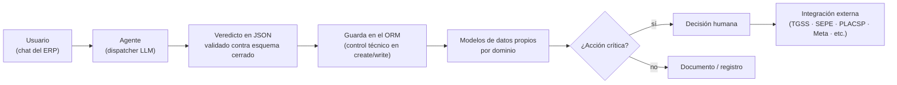

  

# Agentes de IA sobre ERP — siete bots verticales en Odoo

Caso de estudio de arquitectura: siete agentes conversacionales integrados en Odoo 17, cada uno especializado en un dominio de negocio, que ejecutan acciones reales sobre el ERP en lugar de limitarse a consultarlo. El código es propiedad del cliente — esta vitrina documenta la arquitectura, no publica el fuente.

## El problema

Cada dominio tenía su propio proceso manual y repetitivo: cribar currículos, vigilar boletines de licitación pública, tramitar altas y bajas ante la Seguridad Social y el SEPE, planificar rutas y reposición de stock, vigilar el mercado y la competencia, dar seguimiento al ciclo comercial, revisar partes de mantenimiento antes de enviarlos al cliente. El objetivo común: un agente que ejecute el trabajo en el ERP —crear registros, avanzar etapas, generar documentos— con un usuario de servicio de permisos acotados y un punto de decisión humana antes de cualquier acción irreversible.

## Los siete agentes

| Bot | Dominio | Hito verificado |
|---|---|---|
| **Sara** | Selección de personal | Extracción de datos de CV validada contra 14 casos adversariales, 0 alucinaciones |
| **Emilio** | Trámites laborales ante Seguridad Social y SEPE | Generador de fichero AFI (formato oficial de ancho fijo) byte-exacto; SILTRA (aplicación oficial, documentada como exclusiva de Windows) ejecutada íntegra en Linux |
| **Lara** | Inteligencia de mercado y competencia | 930 escrituras verificadas en el ERP sin discrepancias; latencia media de 8,3 s tras el rediseño del flujo de escritura |
| **Smith** | Licitaciones públicas | Motor de ingesta de la Plataforma de Contratación del Sector Público (sindicación ATOM/CODICE) con filtrado por código CPV; gate humano a nivel de código antes de emitir cualquier propuesta |
| **Lia** | Logística y flota | Cálculo dinámico de punto de reposición y asignación óptima de transportista sobre datos reales de almacén |
| **Samy** | Comercial | Scoring de pipeline y cobro proactivo sobre `crm.lead` / `sale.order` / `account.move` reales |
| **Marina** | Control de calidad de partes de mantenimiento | Motor de validación de rangos por parámetro e instalación, detección de contradicciones internas en el parte |

## Arquitectura común

Los siete comparten un mismo patrón, replicado y adaptado dominio a dominio:

- **Usuario de servicio con permisos explícitos**: cada agente opera con un usuario de servicio propio y nivel de acceso configurado en código, no con el usuario administrador.
- **Veredicto JSON en vez de escritura directa.** El diseño inicial dejaba que el modelo escribiera directamente en el ERP; se sustituyó por un flujo donde el modelo devuelve un veredicto estructurado que el código valida y persiste de forma síncrona en su propia transacción. El cambio, medido sobre uno de los agentes, redujo la latencia de un rango de 90–200 s a una media de 8,3 s y eliminó los fallos intermitentes de escritura.
- **Confirmación humana implementada como guarda de código**, no como instrucción al modelo. Una auditoría interna rechazó una primera versión del control de envío de propuestas por estar implementada únicamente en el prompt; se corrigió como validación real en `create()`/`write()`, donde el agente no puede saltársela aunque el modelo "decida" hacerlo.
- **Extracción documental validada contra conjuntos de prueba adversariales** antes de confiar en ella (el caso de Sara con CVs es el más medido, pero el patrón se repite en otros agentes).

## Resultados verificados

| Métrica | Valor |
|---|---|
| Extracción de CV sobre golden set adversarial | 14 casos, 0 alucinaciones |
| Escrituras reales verificadas en el ERP | 930, sin discrepancias |
| Latencia de escritura, antes → después del rediseño | 90–200 s → 8,3 s de media |
| Suites de test por proyecto | 625 · 511 · 300 · 94 |
| Fichero oficial de ancho fijo (TGSS) | Byte-exacto contra especificación oficial |

## La dificultad técnica superada

**Ingeniería inversa de SILTRA**, la aplicación oficial de envío a la Seguridad Social, documentada por el fabricante como exclusiva de Windows. El análisis identificó que el bloqueo real no era el runtime — que resultó ser Java puro, ejecutable en cualquier sistema — sino un validador que comprobaba la existencia de una letra de unidad de disco al estilo Windows (`C:`, `D:`). Identificado ese punto concreto, la aplicación se ejecutó íntegra en Linux, evitando levantar una máquina virtual Windows solo para ese trámite.

La segunda dificultad relevante, transversal a varios de los siete agentes, fue la inversión del flujo de escritura descrita arriba: pasar de "el modelo escribe" a "el modelo propone, el código decide y escribe" no es un cambio cosmético — es la diferencia entre un sistema cuya fiabilidad depende del comportamiento del modelo en cada turno y uno cuya fiabilidad depende de una validación determinista.

## Estado honesto

- **Validados funcionalmente en un entorno de staging**, con suites de test propias y baterías de prueba ejecutadas como usuario real. No están desplegados en producción de cliente.
- Cada agente tiene matices propios de estado: por ejemplo, el envío real de trámites de Emilio ante la Seguridad Social sigue pendiente de un trámite administrativo de autorización (no de un bloqueo técnico); Marina tiene su motor de validación construido y verificado, parametrizable por instalación mediante rangos configurables.
- El patrón arquitectónico (usuario de servicio, veredicto JSON, guarda en el ORM, gate humano) es el elemento que se reutiliza entre los siete; cada dominio añade su propia lógica e integraciones externas específicas.

## Stack

Odoo 17 (ORM, modelos custom, QWeb, OWL) · PostgreSQL · Python · XML-RPC · SOAP (Contrat@ del SEPE) · sindicación ATOM/CODICE (Plataforma de Contratación del Sector Público) · ficheros oficiales de ancho fijo (TGSS) · integración con dispatcher LLM propio del ecosistema
